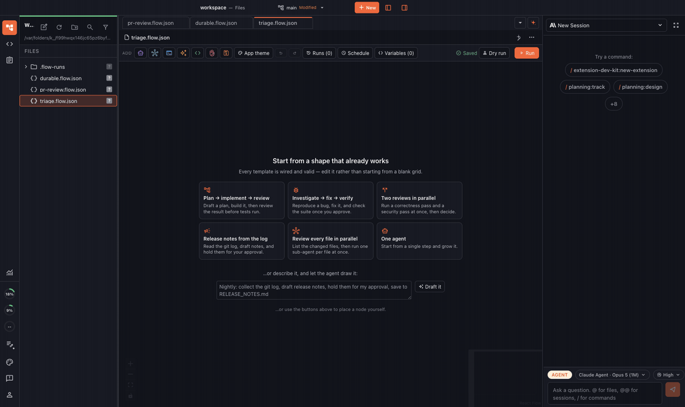
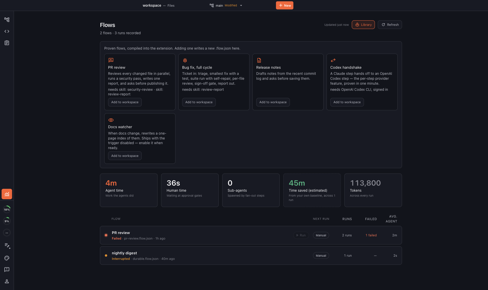
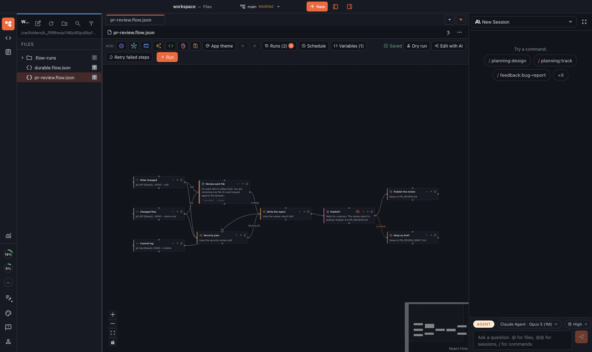
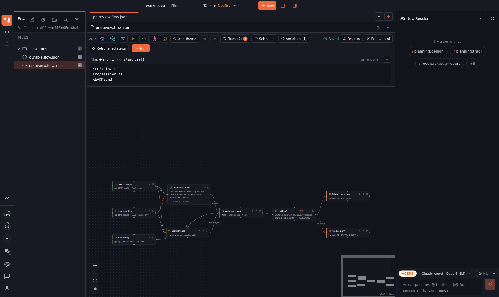
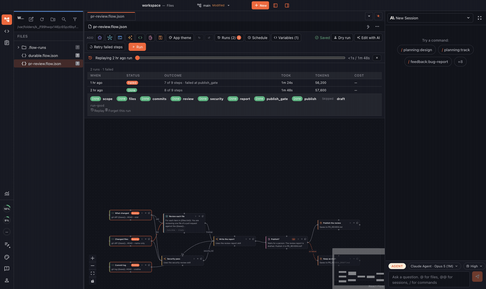
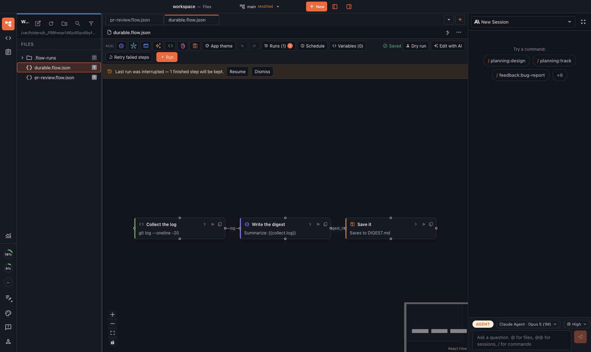

# Flows, in nine frames

Captured from the built app over a staged workspace
(`scratchpad/marketing-probe` pattern: seeded run records, one live
draft-with-AI call). Regenerate by re-running the probe against a fresh
build.

## Describe a flow, get a flow

One sentence into the empty canvas — *"collect the commits, group them into
themes, ask me to approve, save to SUMMARY.md, and keep my rejection reason
as a draft"* — and the agent draws a validated five-step pipeline, including
the `on failure` branch for the rejected gate, unprompted
([still](07-draft-landed.png), [the ask](06-draft-described.png)).

## The Flows home

Five proven flows compiled into the extension, each naming what it needs;
agent-time vs human-time metrics; every flow's health at a glance.

## A real pipeline on the canvas

The PR review flow: three shell probes fan into a parallel per-file review
and a security pass, one report, a human gate, and a publish/draft split on
the gate's answer. The `1/2` chip on the gate is the reliability record —
worn only by steps that have failed.

## Click a wire

The payload panel answers "what actually flowed through here" — the
`{{files.list}}` hand-off from the last run, live during a run.

## Scrub through a finished run

Replay paints the canvas from the record's per-node timings —
[still](04-replay.png).

## Nothing gets lost

A run interrupted by a crash greets the reopened flow with an offer: the
finished steps' outputs are kept, only the rest re-runs.
